<!-- Generated by GitHub Profile Agent Console. Edit profile.config.json, then run npm run generate. -->

  <picture>
    <source media="(max-width: 760px) and (prefers-color-scheme: dark)" srcset="./assets/hero/agent-console-5b9d59da-mobile-dark.svg">
    <source media="(max-width: 760px)" srcset="./assets/hero/agent-console-5b9d59da-mobile-light.svg">
    <source media="(prefers-color-scheme: dark)" srcset="./assets/hero/agent-console-5b9d59da-dark.svg">
    <source media="(prefers-color-scheme: light)" srcset="./assets/hero/agent-console-5b9d59da-light.svg">
    
  </picture>

  

## About Me

I build practical AI and software systems while growing my expertise in data analysis, backend development, and open-source technologies.

I enjoy turning ideas into working projects, exploring new technologies, and learning by building, testing, and improving real-world solutions.

## Current Focus

| Area | What I am exploring |
| --- | --- |
| **AI Agents** | Building practical AI agents with tool use, automation, evaluation, and reliable workflows. |
| **Applied AI** | Turning AI capabilities into practical, testable applications that solve real-world problems. |
| **Data Analytics** | Turning data into useful insights through analysis, visualization, and practical decision-making. |
| **Developer Tools** | Exploring developer tools, automation, and workflows that make software development faster and more reliable. |

## Featured Work

| Project | Focus | Why it matters |
| --- | --- | --- |
| [**Manus-Claude**](https://github.com/STROKE-MODS/Manus-Claude-Bridge) | AI Developer Tool | A developer bridge that connects Claude Code and Manus workflows, enabling smoother collaboration between AI coding, automation, and task execution. [Live](https://claude-manus-bridge.onrender.com/) |
| [**JARVIS**](https://github.com/STROKE-MODS/JARVIS) | Local AI Assistant | A local AI assistant built around open-source language models, designed to provide conversational assistance, automate tasks, and explore private, locally hosted AI workflows. |

## Research Direction

I am interested in building practical AI systems, data-driven applications, and reliable software that can be evaluated, improved, and applied to real-world problems.

## Tech Stack

`Python` · `C` · `C++` · `Java` · `SQL` · `PostgreSQL` · `SQLite` · `Qt` · `QML` · `JavaScript` · `HTML` · `CSS` · `Node.js` · `FastAPI` · `Git` · `Linux` · `Ollama` · `Pandas`

## Recent Activity

<!-- AUTO:ACTIVITY:START -->
_Recent public activity will appear here after the workflow runs._
<!-- AUTO:ACTIVITY:END -->

---

  Building practical AI systems, learning in public, and sharing what works.

